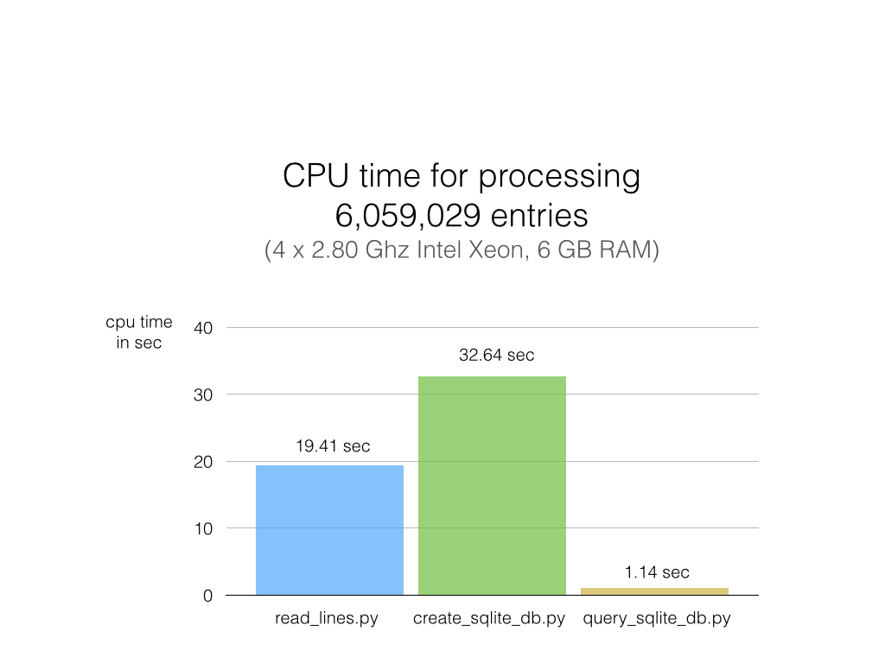

<html>

My new project confronted me with the task to screen a huge set of large data files in text format with billions of entries each.

I will have to retrieve data repeatedly and frequently in future, thus I was tempted to find a better solution than brute-force scanning through ~20 separate 1-column text files with ~6 billion entries every time line by line.

#### OVERVIEW

[SQLite](#sqlite)

[sqlite3 in a nutshell](#sqlite3)

&nbsp;&nbsp;&nbsp;&nbsp;[Creating an SQLite database](#creating_db)

&nbsp;&nbsp;&nbsp;&nbsp;[Updating an existing database](#updating_db)

&nbsp;&nbsp;&nbsp;&nbsp;[Querying the SQLite database](#querying_db)

[Benchmarks](#benchmarks)
		  
&nbsp;&nbsp;&nbsp;&nbsp;[a) read_lines.py](#read_lines)

&nbsp;&nbsp;&nbsp;&nbsp;[b) create_sqlite_db.py](#create_sqlite)

&nbsp;&nbsp;&nbsp;&nbsp;[c) query_sqlite_db.py](#query_sqlite)

[Results and Conclusions](#results)

At the end of the day, I wanted to have a unified database structure available that combines all those columns, which represent different features, that are currently listed in those separate text files. This database should be extendable, and my workflow will require that I can pull out entries with intersecting features for further computation efficiently.

So I've been looking around and it was not too long until I stumbled upon this awesome sqlite3 Python module for working with SQLite database structures.

Fortunately, you don't have to be an SQL expert to dive in, the sqlite3 module documentation is really well written and will serve you as a good point of entry:

[http://docs.python.org/2/library/sqlite3.html](http://docs.python.org/2/library/sqlite3.html)

 

SQLite is an open-source SQL database engine that is ideal for smaller workgroups, because it is a single locally stored database file that does not require any server infrastructure.

Furthermore, SQLite works on all common operating systems and is compatible to 32bit and 64bit machines. There are plenty of applications that let you use the powerful SQL syntax, and SQLite has gained a reputation of being very reliable as it is used by popular companies, such as Google, Mozilla, Adobe, Apple, Microsoft, etc. The only downside I could find was that there is a size limit of 140 terabytes per database file, but "foreign keys" allow cross-queries between different data base files, so even this size limit shouldn't be a big concern.

If you want to learn more about SQLite, you can check out their website at [http://www.sqlite.org](http://www.sqlite.org).

# sqlite3 in a nutshell

In the following section I will present some code to show how easy it is to use the sqlite3 module in Python. I added comments with the hope to make it as self-explanatory as possible.
After the code examples I have some interesting benchmarks that demonstrates the efficiency of SQL queries.

## Creating an SQLite database
<pre>
    import sqlite3

  # create new db and make connection
    conn = sqlite3.connect('my_db.db')    
    c = conn.cursor()

   # create table
    c.execute('''CREATE TABLE my_db
                 (id TEXT, my_var1 TEXT, my_var2 INT)''')

   # insert one row of data
    c.execute("INSERT INTO my_db VALUES ('ID_2352532','YES', 4)")

    # insert multiple lines of data
    multi_lines =[ ('ID_2352533','YES', 1),
                   ('ID_2352534','NO', 0),
                   ('ID_2352535','YES', 3),
                   ('ID_2352536','YES', 9),
                   ('ID_2352537','YES', 10) 
                  ]
    c.executemany('INSERT INTO my_db VALUES (?,?,?)', multi_lines)

    # save (commit) the changes
    conn.commit()

    # close connection
    conn.close()
</pre>

**Note**:  As a careful reader pointed out in the comment section below, it would make sense to use integers as IDs instead of strings to increase computational efficiency - given that the relevant identifier consisted of numbers only.
In the case I picked for this example (ID_2352533, ID_2352534, ...) the IDs seems to follow the same pattern: "ID_" + number. So instead of using it as is, we could convert it to an integer before we insert it into the database.
E.g., by a simple Python expression:_ ` int("ID_2352533"[3:])`

## Updating an existing database

<pre>

import sqlite3

# make connection to existing db
conn = sqlite3.connect('my_db.db')
c = conn.cursor()

# update field
t = ('NO', 'ID_2352533', )
c.execute("UPDATE my_db SET my_var1=? WHERE id=?", t)
print "Total number of rows changed:", conn.total_changes

# delete rows
t = ('NO', )
c.execute("DELETE FROM my_db WHERE my_var1=?", t)
print "Total number of rows deleted: ", conn.total_changes

# add column
c.execute("ALTER TABLE my_db ADD COLUMN 'my_var3' TEXT")

# save changes
conn.commit()

# print column names
c.execute("SELECT * FROM my_db")
col_name_list = [tup[0] for tup in c.description]
print col_name_list

# close connection
conn.close()

</pre>

## Querying the SQLite database

<pre>

import sqlite3

# open existing database
conn = sqlite3.connect('my_db.db')

c = conn.cursor()

# print all lines ordered by integer value in my_var2
for row in c.execute('SELECT * FROM my_db ORDER BY my_var2'):
    print row

# print all lines that have "YES" as my_var1 value 
# and have an integer value &lt;= 7 in my_var2
t = ('YES',7,)
for row in c.execute('SELECT * FROM my_db WHERE my_var1=? AND my_var2 &lt;= ?', t):
    print row

# print all lines that have "YES" as my_var1 value 
# and have an integer value &lt;= 7 in my_var2
t = ('YES',7,)
c.execute('SELECT * FROM my_db WHERE my_var1=? AND my_var2 &lt;= ?', t)
rows = c.fetchall()
for r in rows:
    print r

# close connection
conn.close()

</pre>

# Benchmarks

After I tinkered with the sqlite3 module, my next important question was: How fast is SQLite really?

To do some simple speed comparisons, I set up an example file of 6.1 Million lines (75 Mb) in order to measure the CPU time to 

 a) read in the text file line by line with simple Python code 

b) read in the text file to create an SQLite database 

c) query the whole data base.

I simply wanted to see how much I can gain by querying the database (c) in contrast to reading the whole file from scratch every time (a). I was also interested how long it might take to build the SQLite data base in the first place.
Note that this is just a simplified example using a single text file consisting of one column. In a real application I would have to scan 20 files with 6 billion rows each or querying 1 database with 6 billion entries in 21 columns, respectively.

Below you find the 3 short Python scripts that I used to measure the CPU time for the three scenarios a), b), and c) mentioned above.

## a) read_lines.py

<pre>
import time

start_time = time.clock()

lines = 0
    with open("feature1.txt", "rb") as fileobj:
    for line in fileobj:
    lines += 1

elapsed_time = time.clock() - start_time
print "Time elapsed: {} seconds".format(elapsed_time)
print "Read {} lines".format(lines)
</pre>` 

## b) create_sqlite_db.py

<pre>

import sqlite3
import time

start_time = time.clock()

conn = sqlite3.connect('my_db1.db')
c = conn.cursor()

c.execute('''CREATE TABLE my_db1 (id TEXT, feature1 TEXT, feature2 INT)''')

lines = 0
lst = list()

with open("feature1.txt", "rb") as myfile:
    for line in myfile:
    line = line.strip()
    lst.append((line, "Yes", None))
    lines += 1
c.executemany("INSERT INTO my_db1 VALUES (?,?,?)", lst)

conn.commit()
conn.close()

elapsed_time = time.clock() - start_time
print "Time elapsed: {} seconds".format(elapsed_time)
print "Read {} lines".format(lines)

</pre> 

## c) query_sqlite_db.py

<pre>`

import sqlite3
import time

start_time = time.clock()

conn = sqlite3.connect('my_db1.db')
c = conn.cursor()

lines = 0
lst = list()
t = ('YES',)
for row in c.execute('SELECT * FROM my_db1 WHERE feature1=?', t):
    lst.append(row)
    lines += 1

conn.close()

elapsed_time = time.clock() - start_time
print "Time elapsed: {} seconds".format(elapsed_time)
print "Read {} lines".format(lines)

</pre>

## Results and Conclusions

As you can see in the chart below, the results are really impressive, and SQLite didn't disappoint.

Python (on my machine) requires not more than 20 sec to go through 6 million lines of text (first column) - without any additional computation or analysis, however.

When it added those lines to a SQLite database, the CPU time just increases by one-third (second column).
Reading the text file line by line is definitely faster than I expected, but sqlite3 puts the plain Python code in the shade: Querying my whole 6-million-entries-database and pulling out ALL of them just takes about 1 second (third column)! That is approximately 20x faster than Python code scanning a plain text file (remember that 1 have 20 text files and each of those is 1000x larger than this example file).

If we were to make a very simplified comparison: Imagine it would take Python ~5 min to go through every of my real data set files, and I have 20 of them. If I cross compare the data for intersecting features, I would easily end up with &gt; 2 h of CPU time. And this process would have to repeated for every time I set up a new screening.
But if I would have my SQLite database, I could do the same thing in &lt; 1 min. For screening on a daily basis, after the first week I could already come down to 10 h Python line-by-line screening VS. 5 min SQL queries. I think it is just awesome.

</body>
</html>